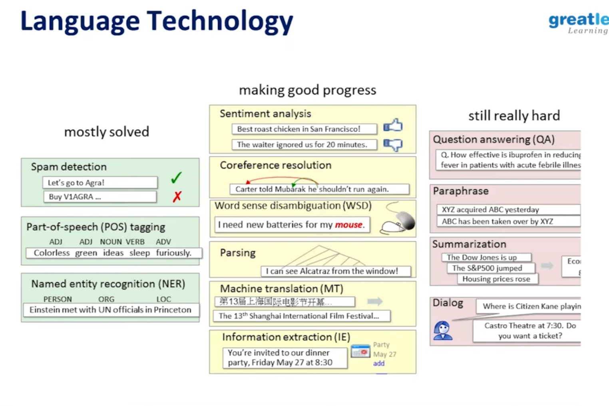

# **Natural language processing**

**21% of the data are structured**

**Natural language processing** (**NLP**) is a subfield of [linguistics](https://en.wikipedia.org/wiki/Linguistics), [computer science](https://en.wikipedia.org/wiki/Computer_science), and [artificial intelligence](https://en.wikipedia.org/wiki/Artificial_intelligence) concerned with the interactions between computers and human language, in particular how to program computers to process and analyze large amounts of [natural language](https://en.wikipedia.org/wiki/Natural_language) data.

Challenges in natural language processing frequently involve [speech recognition](https://en.wikipedia.org/wiki/Speech_recognition), [natural language understanding](https://en.wikipedia.org/wiki/Natural_language_understanding), and [natural-language generation](https://en.wikipedia.org/wiki/Natural-language_generation).

Many different classes of machine-learning algorithms have been applied to natural-language-processing tasks. These algorithms take as input a large set of "features" that are generated from the input data.

focused on [statistical models](https://en.wikipedia.org/wiki/Statistical_models), which make soft, [probabilistic](https://en.wikipedia.org/wiki/Probabilistic) decisions

NLP system: take natural language and process it as your requirement

EX: search engine

**IBM Watson ****Watson is a question-answering computer system**Jeopardy

**Information extraction**

**Sentiment analysis**

**Machine Translation**

## Common NLP Tasks

### 

### **Text and speech processing**

**[Optical character recognitio**n](https://en.wikipedia.org/wiki/Optical_character_recognition)** (OCR)**

Given an image representing printed text, determine the corresponding text.

**[Speech recognitio**n](https://en.wikipedia.org/wiki/Speech_recognition)

Given a sound clip of a person or people speaking, determine the textual representation of the speech.

* opposite of [text to speech](https://en.wikipedia.org/wiki/Text_to_speech)

* [speech segmentation](https://en.wikipedia.org/wiki/Speech_segmentation)

* [Coarticulation](https://en.wikipedia.org/wiki/Coarticulation)

**[Text-to-speec**h](https://en.wikipedia.org/wiki/Text-to-speech)

Given a text, transform those units and produce a spoken representation. Text-to-speech can be used to aid the visually impaired

**[Word segmentatio**n](https://en.wikipedia.org/wiki/Word_segmentation)** (****[Tokenizatio**n](https://en.wikipedia.org/wiki/Tokenization_(lexical_analysis))**)**

Separate a chunk of continuous text into separate words.Sometimes this process is also used in cases like [bag of words](https://en.wikipedia.org/wiki/Bag_of_words) (BOW) creation in data mining.

## Application Of NLP

## **NLP Component**

### **Morphological analysis**

**[Lemmatizatio**n](https://en.wikipedia.org/wiki/Lemmatisation)

grouping together the inflected forms of a word so they can be analysed as a single item, identified by the word's [lemma](https://en.wikipedia.org/wiki/Lemma_(morphology)), or dictionary form

**[Morphological segmentatio**n](https://en.wikipedia.org/wiki/Morphology_(linguistics))

**Tokenization**

on Colab →[https://colab.research.google.com/drive/1h18wWN1gWwFCw-bx4s4S-s7V-rPxnquS?usp=sharig](https://colab.research.google.com/drive/1h18wWN1gWwFCw-bx4s4S-s7V-rPxnquS?usp=sharing)

[https://colab.research.google.com/drive/1h18wWN1gWwFCw-bx4s4S-s7V-rPxnquS?usp=sharing](https://colab.research.google.com/drive/1h18wWN1gWwFCw-bx4s4S-s7V-rPxnquS?usp=sharing)

Also called word segmentor

Challenges:

Chineses words composed of characters

Chineses japanese no spaces between words

**Normalization**

**Text normalization is the process of transforming a text into a canonical (standard) form. For example, the word "gooood" and “gud” can be transformed to “good”, its canonical form. Another example is mapping of near identical words such as “stopwords”, “stop-words” and “stop words” to just “stopwords”.**

#### **Stemming**

Stemming is the process of reducing inflection in words (e.g. troubled, troubles) to their root form (e.g. trouble). The "root" in this case may not be a real root word, but just a canonical form of the original word.

#### **Lemmatization**

Lemmatization on the surface is very similar to stemming, where the goal is to remove inflections and map a word to its root form. 

Stemming just removes or stems the last few characters of a word, often leading to incorrect meanings and spelling. Lemmatization considers the context and converts the word to its meaningful base form, which is called Lemma. Sometimes, the same word can have multiple different Lemmas. We should identify the Part of Speech (POS) tag for the word in that specific context. Here are the examples to illustrate all the differences and use cases:

If you lemmatize the word **'Caring**', it would return 'Care'. If you stem, it would return 'Car' and this is erroneous.

If you lemmatize the word 'Stripes' in verb context, it would return 'Strip'. If you lemmatize it in noun context, it would return 'Stripe'. If you just stem it, it would just return 'Strip'.

You would get same results whether you lemmatize or stem words such as walking, running, swimming... to walk, run, swim etc.

Lemmatization is computationally expensive since it involves look-up tables and what not. If you have large dataset and performance is an issue, go with Stemming. Remember you can also add your own rules to Stemming. If accuracy is paramount and dataset isn't humongous, go with Lemmatization.

#### 

#### 

#### 

#### **Noise Removal**

Noise removal is about removing characters digits and pieces of text that can interfere with your text analysis. Noise removal is one of the most essential text preprocessing steps. It is also highly domain dependent.

**[Stanford CoreNLP** ](https://stanfordnlp.github.io/CoreNLP/)**demo**

## **NLP Algorithm**

**#Simplest metrics**

**Edit distance**

Natural Language Processing usually signifies the processing of text or text-based information (audio, video).  An important step in this process is to transform different words and word forms into one speech form. Also, we often need to measure how similar or different strings are. Usually, in this case, we use various metrics showing the difference between words.

One of the simple and at the same time popularly usable metrics is Edit distance (sometimes is known as *Levenshtein distance*) - an algorithm for estimating the similarity of two string values (word, words form, words composition), by comparing the minimum number of operations to convert one value into another.

An example of Edit distance execution is shown below.

So this algorithm  includes the following text operations:

* inserting a character into a string;

* delete (or replace) a character from a string by another character;

* characters substitutions.

Popular NLP applications for Edit distance:

* automatic spell-checking (correction) systems;

* in bioinformatics - for quantifying the similarity of DNA sequences (letters view);

* text processing - define all the proximity of words that are near to some text objects.

#**Cosine similarity**

Cosine similarity is a metric used for text similarity measuring in various documents. Calculations for this metric are based on the measures of the vector's similarity by cosine vectors formula:

You can use various text features or characteristics as vectors describing this text, for example, by using text vectorization methods. For example, the cosine similarity calculates the differences between such vectors that are shown below on the vector space model for three terms.

The calculation result of cosine similarity describes the similarity of the text and can be presented as cosine or angle values.

The results of calculation of cosine distance for three texts in comparison with the first text (see the image above) show that the cosine value tends to reach one and angle to zero when the texts match.

So received cosine similarity values can be used for simple semantic text preprocessing

**#****Vectorization**

Vectorization is a procedure for converting words (text information) into digits to extract text attributes (features) and further use of machine learning (NLP) algorithms. 

In other words, text vectorization method is transformation of the text to numerical vectors. The most popular vectorization method is "Bag of words" and “TF-IDF”.

**Bag of words **

The most intuitive and simple way to vectorize text information involves the following:

* assign to each word a unique integer index to build a dictionary of words with integer indexes;

* count the number of appearances of each word and save it (number) with the relevant index.

As a result, we get a **vector** with a unique index value and the repeat frequencies for each of the words in the text.

Representing the text in the form of vector - "bag of words", means that we have some unique words (n_features) in the set of words (corpus).

**TF-IDF**

TF-IDF stands for Term frequency and inverse document frequency and is one of the most popular and effective Natural Language Processing techniques. This technique allows you to estimate the importance of the term for the term (words) relative to all other terms in a text.

**Main idea**: if a term appears in some text frequently, and rarely in any other text – this term has more importance for this text.

This technique uses TF and IDF algorithms:

* TF – shows the frequency of the term in the text, as compared with the total number of the words in the text.

* IDF – is the inverse frequency of terms in the text. It simply displays the importance of each term. It is calculated as a logarithm of the number of texts divided by the number of texts containing this term.

**TF-IDF algorithm: **

1. Evaluate the TF-values for each term (word).

2. Extract the IDF-values for these terms.

3. Get TF-IDF values for each term: by multiplying TF by IDF.

4. We get a dictionary with calculated TF-IDF for each term.

The algorithm for TF-IDF calculation for one word is shown on the diagram.

The results of the same algorithm for three simple sentences with the TF-IDF technique are shown below.

The advantages of this vectorization technique:

* Unimportant terms will receive low TF-IDF weight (because they are frequently found in all texts) and important – high.

* It is simple to evaluate important terms and stop-words in text.

### **#Stemming and Lemmatization**

Usually, text documents use different word forms, for example:

Also, there are words with similar definitions: 

The stemming and lemmatization object is to convert different word forms, and sometimes derived words, into a common basic form.

Stemming is the technique to reduce words to their root form (a canonical form of the original word). Stemming usually uses a heuristic procedure that chops off the ends of the words.

Stemming is useful for standardizing vocabulary processes. At the same time, it is worth to note that this is a pretty crude procedure and it should be used with other text processing methods.

Lemmatization is the text conversion process that converts a word form (or word) into its basic form – lemma. It usually uses vocabulary and morphological analysis and also a definition of the Parts of speech for the words.

The difference between stemming and lemmatization is that the last one takes the context and transforms a word into lemma while stemming simply chops off the last few characters, which often leads to wrong meanings and spelling errors.

So, lemmatization procedures provide higher context matching compared with basic stemmer.

**Further reading:**

* [Lemmatization And Stemming In NLP - A Complete Practical Guide](https://programmerbackpack.com/lemmatization-and-stemming-in-nlp-the-complete-practical-guide/)

# **Keywords extraction**

**Keywords extraction **is one of the most important tasks of the Natural Language Processing field and is responsible for finding ways for extracting the most important words and phrases from a given text or a collection of texts. This is done in order to help us summarize, organise, store, search and retrieve content in a meaningful and efficient way.

We already have a large number of keywords extraction algorithms available and each applies a different set of principal and theoretical approaches to this problem. We have algorithms that extract only words and algorithms that extract words and phrases. We have algorithms that focus only on one text and algorithms that extract keywords based on a whole collection of texts.

The most popular keywords extraction algorithms out there are:

* **TextRank**: works on the same principle behind the PageRank algorithms by which Google assignes importance to different web pages on the Internet

* **TF-IDF**: Term Frequency - Inverse Document Frequency aims to better define how important a word is for a document, while also taking into account the relation to other documents from the same  corpus.

* **RAKE**: Rapid Automatic Keywords Extraction falls into the category of algorithms that can extract keywords and keyphrases based only on the text of one document, without the need to consider other documents in the same collection.

**Further reading**:

* [Automated Python Keywords Extraction: TextRank vs Rake](https://programmerbackpack.com/automated-python-keywords-extraction-textrank-vs-rake/)

* [TF-IDF Explained And Python Sklearn Implementation](https://programmerbackpack.com/tf-idf-explained-and-python-implementation/)

* [Python Keywords Extraction using TextRank](https://programmerbackpack.com/machine-learning-project-series-part-2-python-keywords-extraction/)

# **Named Entity Recognition**

**Named Entity Recognition **is another very important technique in the Natural Language Processing space. It is responsible with identifying entities in an unstructured text and assigning them to a list of predefined categories: persons, organisations, dates, money and so on.

Named Entity Recognition

Named Entity Recognition actually consists of two substeps: **Named Entity Identification **(identifying potential candidates for the NER algorithm) and **Named Entity Classification **(actually assigning the candidates to one of the predefined categories).

**Further reading**:

* [Python Named Entity Recognition](https://programmerbackpack.com/machine-learning-project-series-building-a-personal-knowledge-management-system-part-1-named-entity-recognition/)

# **Topic Modelling**

**Topic Modelling** is NLP task where we try to discover "abstract topics" that can describe a collection of documents. This means we have a collection of texts and we try to find patterns of words and phrases that can help us [cluster the documents](https://programmerbackpack.com/k-means-clustering-explained/) and group them by "topics".

One of the most popular algorithms for Topic Modelling is the Latent Dirichlet Allocation. For this algorithm to work you need to establish a predefined number of topics to which your collection of documents can be assigned to.

At first you assign every text in your dataset to a random topic and then you go over the collection multiple times, refine your model and reassign documents to different topics.

This is done by measuring two statistics:

* the probability that a certain document belongs to a certain topic;  this is based on how many words(except the currrent word) from this document belong to the topic of the current word

* the proportion of documents that are assigned to the topic of the current word because of the current word.

**Further reading**:

* [Latent Dirichlet Allocation For Topic Modelling Explained: Algorithm And Python Scikit-Learn Implementation](https://programmerbackpack.com/latent-dirichlet-allocation-for-topic-modelling-explained-algorithm-and-python-scikit-learn-implementation/)

# **Knowledge graphs**

**Knowledge graphs **represent a method of storing information by means of **triples **- a set of three items: a subject, a predicate and an object.

Knowledge graphs belong to the category of information extraction techniques - obtaining structured information from unstructed texts.

Knowledge graph example

Knowledge graphs have been immensely popular lately, especially because many companies(think for example the Google Knowledge Graph) use them for various products and services.

Building a knowledge graph requires a large variety of NLP techniques(possible every technique mentioned in this article) and using more of these techniques will likely help you build a more complete and powerful knowledge graph.

**Further reading**:

* [Python NLP Tutorial: Building A Knowledge Graph using Python and SpaCy](https://programmerbackpack.com/python-nlp-tutorial-information-extraction-and-knowledge-graphs/)

**#Naive Bayes algorithm**

The Naive Bayesian Analysis (NBA) is a classification algorithm that is based on the Bayesian Theorem, with the hypothesis on the feature's independence.

In other words, the NBA assumes the existence of any feature in the class does not correlate with any other feature. That's why such an approach is called "Naive". The advantage of this classifier is the small data volume for model training, parameters estimation, and classification.

In most cases, NBA in the Natural Language Processing sphere is used for text classification (clustering). The most known task is a spam detection filter. Most solutions in this sphere use the maximum likelihood method to estimate the parameters of Naive Bayesian models:

The first multiplier defines the probability of the text class, and the second one determines the conditional probability of a word depending on the class.

Approach advantages:

* Classification and multiclass classification, are quick and simple.

* On the assumption of words independence, this algorithm performs better than other simple ones.

* The NBA works with categorical features better than with continuous ones.

 

The most popular applications for text analysis are:

* Text classification.

* Spam filtering.

* Text tonality analysis.

**Word embedding**

Word embedding is a set of various methods, techniques, and approaches for creating Natural Language Processing models that associate words, word forms or phrases with number vectors.

Word embedding principles: words that appear in the same context have similar meanings. In this case, the similarity is broadly understood that only similar words can be located nearby (in context).

The model predicts the probability of a word by its context. So, NLP-model will train by vectors of words in such a way that the probability assigned by the model to a word will be close to the probability of its matching in a given context (Word2Vec model).

Generally, the probability of the word's similarity by the context is calculated with the softmax formula. This is necessary to train NLP-model with the backpropagation technique, i.e. the backward error propagation process.

The most popular word embeddings:

* Word2Vec – uses neural networks to calculate word embedding based on words’ context.

* GloVe – uses the combination of word vectors that describes the probability of these words’ co-occurrence in the text.

* FastText – uses a similar principle as Word2Vec, but instead of words it uses their parts and symbols and as a result, the word becomes its context.

For today Word embedding is one of the best NLP-techniques for text analysis.

**Long short-term memory**

Long short-term memory (LSTM) – a specific type of neural network architecture, capable to train long-term dependencies. Frequently LSTM networks are used for solving Natural Language Processing tasks. 

LSTM network include several interacting layers:

* cell state,

* input gate layer,

* cell status update,

* output data.

The main component of LSTM is the cell state – a horizontal line (с0-с1). The condition of the cell is similar to a conveyor line. Information passes directly through the entire chain, taking part in only a few linear transforms. The information can flow without any changes.

LSTM can also remove the information from a cell state (h0-h1). This process is controlled by filters (gates – Q-cells). The LSTM has three such filters and allows controlling the cell’s state.

LSTM variations:

* "peephole connections" – filter layers can additionally control the cell state;

* "forgotten" and input filters – adds options to ignore or keep in memory information as a joint decision by networks cells;

* gated recurrent units (GRU) – the "forgetting" and input filters integrate into one "updating" filter (update gate), and the resulting LSTM model is simpler and faster than a standard one.

Natural Language Processing tasks for which LSTM can be useful:

* Question Answering.

* Sentiment Analysis.

* Image to Text Mappings.

* Speech Recognition.

* Part of Speech Tagging.

* Named Entity Recognition.

So, LSTM is one of the most popular types of neural networks that provides advanced solutions for different Natural Language Processing tasks.

**Stanford CS224N**

## **Lecture 1**

Human language bandwidth is very low

**NLTK**

**After **2013 people start to use neural networks style system representation for natural language processing

Words can be represented by one-hot vectors:  

